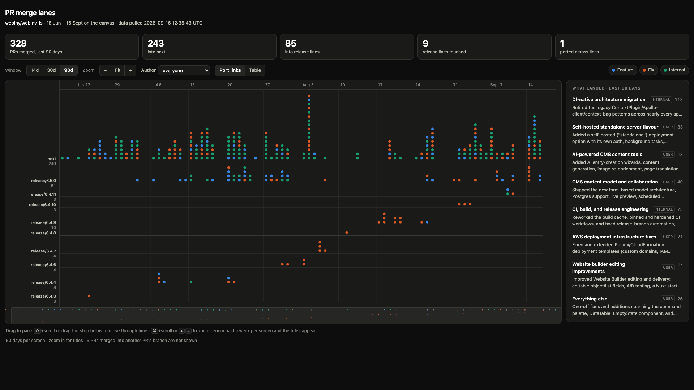

# PR merge lanes

A one-page view of what has been merged, and into which line.

GitHub's merged-PR list is one flat stream. When 3-4 PRs land every working day
across `next` and several `release/*` branches at once, that stream stops
answering the question people actually have: what went into which line, and when.

This draws one horizontal lane per target branch, time along the x axis, one dot
per merged PR. Dots stack upward within a merge day, so a busy day is a tall
column and the release trains read as a staircase.

It's a canvas rather than a fixed chart. Zoomed out you get the shape of a whole
quarter; zoom in and a day column gets wide enough to print PR titles next to
the dots, so you stop hovering things one at a time to find out what they are.



## Use it

```bash
./fetch.sh          # pulls merged PRs via gh, writes data.js
./summarize.sh      # groups them into work streams, writes summary.js
open index.html     # no server needed
```

`fetch.sh` needs the `gh` CLI, authenticated against an account that can see the
repo. Two env vars change what it pulls:

```bash
PR_GRAPH_REPO=webiny/wcp PR_GRAPH_DAYS=180 ./fetch.sh
```

Re-run `fetch.sh` whenever you want fresh data. The page reads `data.js` off
disk, so there is nothing to deploy and nothing to keep running.

`summarize.sh` is optional. Without it the chart works and the panel just tells
you to run it.

## What landed

The lanes answer how much, where and when. They can't answer what, and neither
can a 76-row table of commit titles. Commit scopes don't group the work either:
over a recent fortnight those 76 PRs carried 30-odd distinct scopes with 15
having none at all.

So `summarize.sh` sends the titles through `claude -p` and asks for 4 to 8 work
streams, ordered by how much someone on the team would care. It found things like
this, which is the kind of grouping neither the dots nor the table can show:

```
DI cleanup and background-task rework   [internal]   29 PRs
A running architecture effort replaced per-request container initializers
with on-demand dependency resolution across file manager, scheduler,
workflows, ACO, website builder and event handling, then carried the same
definition/handler split into background tasks.
```

29 of 81 PRs, one piece of work.

Click a stream and the canvas scrolls to where that work happened, lights up its
PRs and dims everything else. That's where the two halves pay off together: you
read what the work was, then see when it landed and which lines it went to, with
its titles legible and the surrounding noise pushed back. Click it again to clear.

The script generates one summary per time range, so the panel always matches the
range toggle. It uses the `claude` CLI rather than the API, so there's no key to
configure. `PR_GRAPH_MODEL` picks the model, `PR_GRAPH_WINDOWS` the ranges.

Two guards on the output, since this is a model writing JSON. Any PR number the
model invents is dropped, and any it forgets is swept into "Everything else", so
the stream counts always add up to the PR count. If it returns something that
isn't JSON twice in a row, the script skips that window and saves the raw reply
rather than writing a broken `summary.js`.

## Reading the chart

Lanes are ordered with `next` on top, then release branches newest first. A PR
whose base is another PR's branch (a stacked PR) is counted in the footnote but
not drawn, since it has no release line of its own.

Color is the change type, parsed from the conventional-commit prefix in the title:

- Feature: `feat`
- Fix: `fix`, `perf`
- Internal: `refactor`, `chore`, `ci`, `docs`, `build`, `test`, `style`, `revert`

Three colors rather than one per prefix is deliberate. Past three categories, a
dot plot can't keep the hues apart for colorblind readers, so the exact prefix
lives in the tooltip and the table instead.

A dashed link joins two PRs with the same title on different lines, which is what
a port looks like from the outside. Generic titles (`chore: update dependencies`
and merge commits) are excluded, or every dependency bump would link to every
other one.

Hover any dot for the PR, click to open it on GitHub. The Table button lists the
same filtered set as text.

## Streams view

The View toggle swaps the marks. `PRs` draws one dot per pull request. `Streams`
draws one bar per work stream per lane, from its first merge on that line to its
last, with a tick for every PR inside it.

That turns six PRs that are really one effort into one labeled bar. On a recent
month `next` reads as six bars instead of ninety dots, the longest being
"Handlers and tasks rewritten for DI" with 35 ticks spread across the whole
window. The ticks matter: a bar with its ticks bunched at one end is a burst, a
bar with them spread evenly is a long grind.

Bars are colored by whether the work is user-facing or internal, since the bar
already carries its own name and doesn't need color to identify it.

This view only covers the summary window, because the window is all the model
grouped. Lanes with nothing in it drop out rather than render empty.

## Getting around

Time runs left to right across the full fetched range, lanes stack top to bottom,
and the canvas scrolls both ways.

| | |
|---|---|
| Drag, or two-finger scroll | pan |
| `shift`+scroll | move through time |
| `cmd`+scroll, `+` / `-`, or the zoom buttons | zoom around the cursor |
| Arrow keys | pan by a screen |
| `0` or Fit | back to the whole window |
| The strip under the canvas | overview; click or drag it to jump |

Titles appear once a PR has room for about 10 characters. That depends on free
space rather than zoom alone, so a lone PR on a quiet release line prints its
whole title while a 16-PR day stays truncated until you go further in. Roughly,
a fortnight per screen is where most titles become readable.

The Window buttons pick the summary window and frame that many days. They don't
limit the canvas, which always holds everything `fetch.sh` pulled, so you can
keep scrolling back past the edge of the window.

## Hosting

The site is four static files with no build step, so GitHub Pages serves it as
is. `.github/workflows/refresh.yml` runs nightly at 05:00 UTC, re-runs both
scripts and commits `data.js` and `summary.js` if anything changed, which
republishes the page.

Those two files are committed rather than ignored, because Pages has to serve
something and the Action needs a base to diff against.

What it needs:

- `ANTHROPIC_API_KEY` as a repository secret, for the summarize step. Without it
  the workflow warns, skips that step and keeps the committed `summary.js`, so
  the chart still refreshes.
- Nothing else for a public source repo. The default `GITHUB_TOKEN` reads public
  repos fine. Point it at a private one and you'll need a PAT in `GH_PAT`.

`PR_GRAPH_REPO` and `PR_GRAPH_DAYS` are repository variables, so you can retarget
it without touching the workflow.

## What this doesn't do yet

Title matching only catches ports that kept their title. The real drift question
is which commits exist on `release/6.5.0` but are not reachable from `next`, and
that needs a local clone and `git cherry` rather than the GitHub API. That's the
next thing worth building if this view proves useful.

Lane height is set by the busiest day in the whole range, so a lane can carry a
lot of empty space above a quiet stretch. Sizing it to what's actually on screen
would mean relaying out on every scroll, which is a worse trade than the gap.
